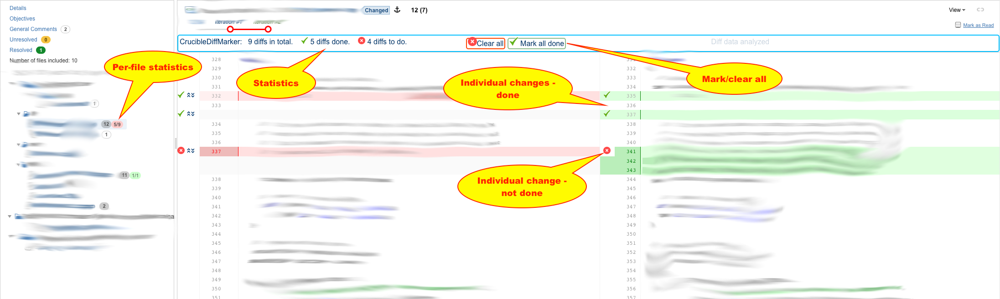

# Crucible Diff Marker

A small Chrome extension that adds ability to mark individual diffs inside a file as done / not done.

A result of half a day of work, it was fun to go blindly where I never ventured before 
(Chrome extensions, understanding Crucible pages, etc.)

## Functionality
* Marking individual changes as done / not done
* Tracking per-file statistics of individual changes
* Local browser persistence
* Ability to mark all changes as done/not done

## Installation

* In Chrome, go to chrome://extensions/
* Enable "Developer mode"
* Click "Load unpacked"
* Point to ``src`` directory in this tree
* Done

## Example screenshot

