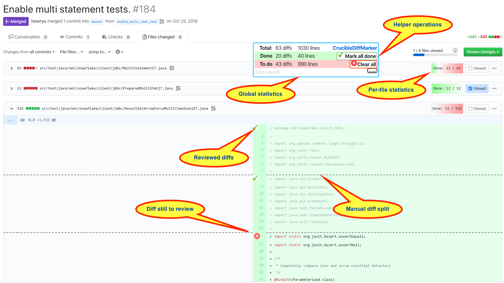

# Review Pal

A small Chrome extension for GitHub 
that adds ability to mark individual changes (diff sections) 
inside a file as done / not done. 
It also allows splitting diffs into smaller sections (and marking them separately)
 and has a few other nice improvements

It is super useful when reviewing complex diffs, with a lot of changes, or very large changes.

It was originally developed for Crucible, but that backend is not maintained.
The first version was a result of roughly a day of work, it was fun to go blindly where I never ventured before 
(Chrome extensions, understanding Crucible pages, and refreshing JS a bit...).

## Functionality

* Marking individual changes as done / not done
* Manually breaking a change into smaller changes
  * How: Middle-click on the (2nd or later) line in a change to split or unsplit
  * Very useful for splitting huge changes (or entire new files) into smaller review units 
* Ability to jump to the next done / todo change.
  * How: Click on "X diffs done" or "Y diffs to do" 
* Local browser persistence
* Ability to mark all changes as done/not done
  * in GitHub: per-file and globally
  * In Crucible: per-file only
* Statistics
* Keyboard shortcuts:
  * `shift+K` - next unreviewed diff
  * `shift+ctrl+K` - next diff
  * `shift+X`, `shift+ctrl+X` - mark diff reviewed / unreviewed
* Ability to highlight multiple words with double-click, up to 8 different highlights. (*Github only*)

Github limitations:
* Only works in split view currently (if I get enough requests, will unified view support)
* Only activates if one opens the `https://github.com/.../pull/<NUMBER>/files` page. 
  **Note that you might need ot reload that page for this to activate.**  
* When watching the same PR with a different subset of commits, the same "diff" (same changed lines)
  might not be recognized as such, as they might have different positions (line numbers) in the file.
  So e.g. marking a diff as done when reviewing a single commit 
  might not be reflected in all-commits review.
* **If someone has an idea how to improve either of the above, please let me know**

Crucible only:
* Automatically marking entire-file as reviewed once individual changes are reviewed
* Works in both unified and side-by-side views
* Tracking per-file statistics of individual changes

#### Disclaimer

* Only matches these URLs:
    * ``https://*/fisheye/cru/*``
    * ``https://github.com/*/pull/*/files*``
    * ``https://github.com/*/pull/*/commits*``
  modify manifest.json if your Crucible is installed somewhere else
* Only tested on Crucible 4.5 !!!

## Installation

Currently, this extension is only available as a source code. 

To install it:
* In Chrome, go to ``chrome://extensions/``
* Enable "Developer mode"
* Click "Load unpacked"
* Point to the ``src`` directory in this tree
* Reload the GitHub/Crucible page
* Done

## Example screenshot - GitHub

## Example screenshot - Crucible

